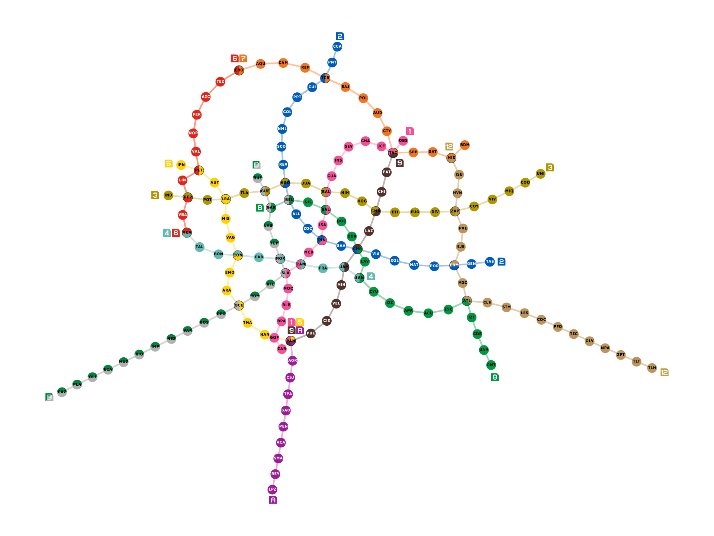

# grafo_MetroCDMX
Una visión a través del grafo para la red del Sistema de Transporte Colectivo de la Ciudad de México

[Verlo en Google Colab](https://colab.research.google.com/gist/Metro-JS/839f0cb343b0b39923e96e097742902f/v1_grafometrocdmx.ipynb)

Para este trabajo se ha decidido nombrar cada estacion con un ID unico e irrepetible de tres caracteres. De este modo, facilitamos el tratamiento de datos en nuestros archivos de regitro en formato CSV, sin perder de vista que con que estacion estamos trabajando.

El programa puede generar cualquier ruta a partir de la entrada de dos puntos. Por ahora, el ir de una estacion a otra no tiene costo (una ponderacion de tiempo o algo similar), asi que la ruta mas corta solo consiste en el recorrido del menor numero de estaciones.
